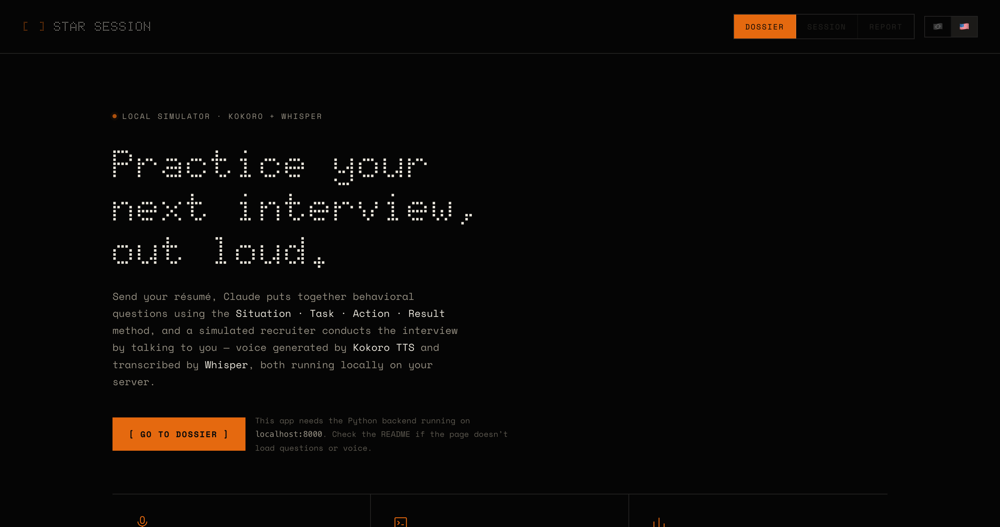

# STAR Session



## Why this exists

Everyone who has ever gone through a hiring process has heard the advice: "practice your answers using the STAR method." The problem was never understanding what STAR means — Situation, Task, Action, Result. The problem is practicing it *out loud*, against a question that actually relates to your résumé and the specific job you're applying for, without having to talk a friend into playing recruiter again, or paying a coach just to listen to you talk for twenty minutes.

The usual alternatives run into another problem too: generic question banks don't know you led a team of four people at Norteluz Logistics, and real AI voice tools usually mean sending your résumé and your voice to some paid cloud API, session after session.

STAR Session was built to solve both at once: questions that cross-reference *your* résumé with *this* job's JD, and a real spoken interview — Kokoro TTS voicing the recruiter, Whisper transcribing your answer — running entirely on your own computer, with no per-minute cost and no voice data leaving the machine.

## What it does

0. You pick the language from the flag at the top (🇧🇷 Portuguese or 🇺🇸 English) — résumé, job, questions, voice, and report all follow that choice end to end.
1. You upload your résumé (PDF, DOCX, TXT, or pasted directly) and paste the job description (JD).
2. Claude cross-references both and puts together 6 behavioral questions using the STAR method — including questions that deliberately probe a job requirement your résumé doesn't yet prove.
3. Before anything counts, a practice round with a tutor briefly explains the method and gives feedback on a warm-up answer, none of which affects the final score.
4. The real interview starts: a simulated recruiter speaks each question out loud, you answer through the microphone, and the transcript appears on screen — editable, in case Whisper mishears a word.
5. If an answer is too short or misses key STAR elements, the recruiter asks one targeted follow-up before moving on — then merges both parts into the final transcript.
6. At the end, a report points out, question by question, where your answer covered Situation, Task, Action, and Result — and where it fell short.
7. The session is saved to your local history. The report now includes coverage bars and a timeline of recent sessions so progress is visible, not just described.
8. Once enough answers pile up, language-specific models trained on your own response patterns start aiming future questions exactly at the themes where you tend to drop the ball.

## How it works under the hood

```
browser  <-- plain HTML/CSS/JS, no build step
    |
    | fetch()
    v
FastAPI (backend/main.py)
    |-- /api/extract-resume  -> pypdf / python-docx
    |-- /api/questions       -> Claude API (fallback: local heuristic)
    |-- /api/tts             -> Kokoro TTS   (lock: 1 call at a time)
    |-- /api/stt             -> Whisper      (lock: 1 call at a time)
    |-- /api/tutor-feedback  -> Claude API (fallback: local heuristic)
    |-- /api/follow-up      -> Claude API (fallback: local heuristic)
    |-- /api/report          -> Claude API (fallback: local heuristic)
    |-- /api/session/save    -> SQLite (backend/db.py)
    |-- /api/insights        -> predictive model (backend/ml.py)
```

Everything goes through the backend, including voice generation and transcription — not because the browser can't record audio, but because Kokoro and Whisper are real Python models with weights well over 100 MB, and there's no version of them running purely in browser JavaScript. The Claude API key follows the same logic as always: it never leaves the server.

**History and predictive model.** Every finished session — résumé, JD, questions, answers, report — is saved to SQLite (`backend/db.py`). A keyword list decides, answer by answer, which of the four STAR elements seem covered: it's the "teacher" that labels the data. With fewer than 20 real answers in the history, that heuristic is the only voice that speaks. From the twentieth answer on, `ml.py` trains a text classifier (TF-IDF + logistic regression, one per STAR element) over everything answered so far. Portuguese and English have separate datasets and model artifacts, so one language cannot contaminate the other. It retrains on every saved session, and the theme where your historical coverage is lowest goes straight into the prompt for the next round of question generation.

**Adaptive follow-ups.** The recruiter does not blindly advance after every answer. `/api/follow-up` checks the answer's STAR coverage and length; when important structure is missing, it asks one focused question about the highest-value gap (usually the task, action, or measurable result). If the answer is already complete, the interview continues immediately. This keeps the session conversational without turning every answer into an interrogation.

**Visual progress.** `/api/insights` returns language-filtered aggregates, per-element STAR coverage, weaker themes, and the latest sessions. The report view renders that payload as coverage bars and a compact timeline, making it easy to see whether practice is improving over time.

**Honest limitation:** it's a simple classifier, trained only on what you practice on this machine — it doesn't judge whether your answer is *good*, only whether it structurally seems to cover the four elements of the method, and it needs dozens of answers before it says anything the keyword heuristic wouldn't already say. And since Kokoro and Whisper aren't safe for concurrent calls, the backend serializes both behind a lock — fine for one candidate practicing alone, a bottleneck if this ever had to serve several people at once.

## System requirements

- Python 3.10+
- [espeak-ng](https://github.com/espeak-ng/espeak-ng) — used by Kokoro to phonemize both Portuguese and English:
  ```bash
  brew install espeak-ng
  ```
- ffmpeg — used to decode the audio recorded in the browser before sending it to Whisper:
  ```bash
  brew install ffmpeg
  ```

## Installation

```bash
cd backend
python3 -m venv .venv
source .venv/bin/activate
pip install -r requirements.txt
cp .env.example .env
```

Edit `.env` and add your `ANTHROPIC_API_KEY` if you want personalized STAR questions and a
final report generated by Claude. Without the key, the app still works, but falls back to
heuristic (more generic) questions and reports.

## Running it

```bash
cd backend
source .venv/bin/activate
uvicorn main:app --reload
```

Open http://localhost:8000 in your browser (Chrome or Edge recommended, for more reliable
microphone permission).

## First run

- **Kokoro** downloads its model weights (a few hundred MB) on the first call to `/api/tts`.
- **Whisper** (`faster-whisper`, `small` model by default) downloads its weights on the first
  call to `/api/stt`.
- Both are cached locally after that; later sessions load instantly.

## Environment variables (`backend/.env`)

| Variable | Default | Description |
|---|---|---|
| `ANTHROPIC_API_KEY` | — | Anthropic API key. Without it, questions and the report fall back to a local heuristic. |
| `ANTHROPIC_MODEL` | `claude-haiku-4-5` | Claude model used to generate questions and the report. |
| `WHISPER_MODEL` | `small` | Whisper model size (`tiny`, `base`, `small`, `medium`, `large-v3`). Larger models are more accurate and slower. |
| `KOKORO_VOICE` | `pm_alex` | Kokoro voice for the recruiter in Portuguese. pt-BR voices: `pf_dora` (female), `pm_alex`, `pm_santa` (male). |
| `KOKORO_VOICE_EN` | `af_heart` | Kokoro voice for the recruiter in English (when 🇺🇸 is selected). English voices: `af_heart`, `af_bella` (female), `am_adam`, `am_michael` (male). |

## Project structure

```
backend/
  main.py            FastAPI: every endpoint, plus serving the static frontend.
  db.py              SQLite persistence (backend/data/star_session.db, outside git).
  ml.py              Language-specific predictive models (scikit-learn) for STAR coverage.
  tests/             Automated tests for persistence, migrations, API fallbacks, follow-ups, and ML isolation.
  requirements.txt
  .env.example
frontend/
  index.html         Single-page UI (plain HTML/CSS/JS, no build step).
docs/
  screenshot.png     Screenshot used in this README.
```

The frontend records the answer with `MediaRecorder`, sends the audio to `/api/stt`, and gets
back the transcribed text (not live streaming — it records, stops, then transcribes). The
question is synthesized once through `/api/tts` and the audio is cached in the browser for the
session, so "play again" doesn't trigger a new call to Kokoro.

## Testing

```bash
source backend/.venv/bin/activate
pytest -q -p no:cacheprovider backend/tests
```

The suite deliberately avoids loading the heavy Kokoro and Whisper weights. It covers the
language-aware SQLite schema and legacy migration, separate PT/EN ML artifacts, bilingual local
fallbacks, adaptive follow-up decisions, and the insights payload used by the visual history.

**Privacy:** `backend/data/` (SQLite database + trained model) and `backend/.env` (your API key)
stay out of git — the former holds résumé excerpts and the answers you speak during your practice
interviews.

## Common issues

- **Voice generation error (Kokoro)**: make sure `espeak-ng` is installed (`espeak-ng --version`).
- **Transcription error (Whisper)**: make sure `ffmpeg` is installed (`ffmpeg -version`).
- **Microphone never asks for permission**: access it via `http://localhost:8000` (not a mix of
  `127.0.0.1` and another host) — browsers require a secure context (localhost counts as secure)
  for `getUserMedia`.
